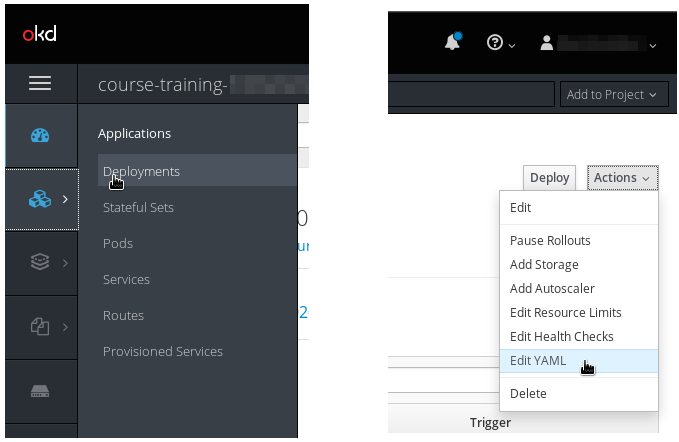
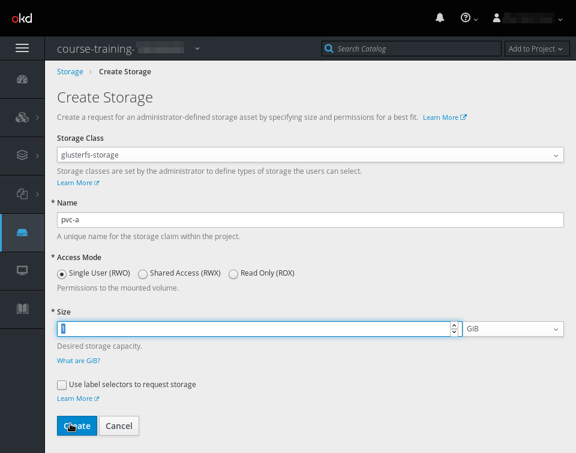
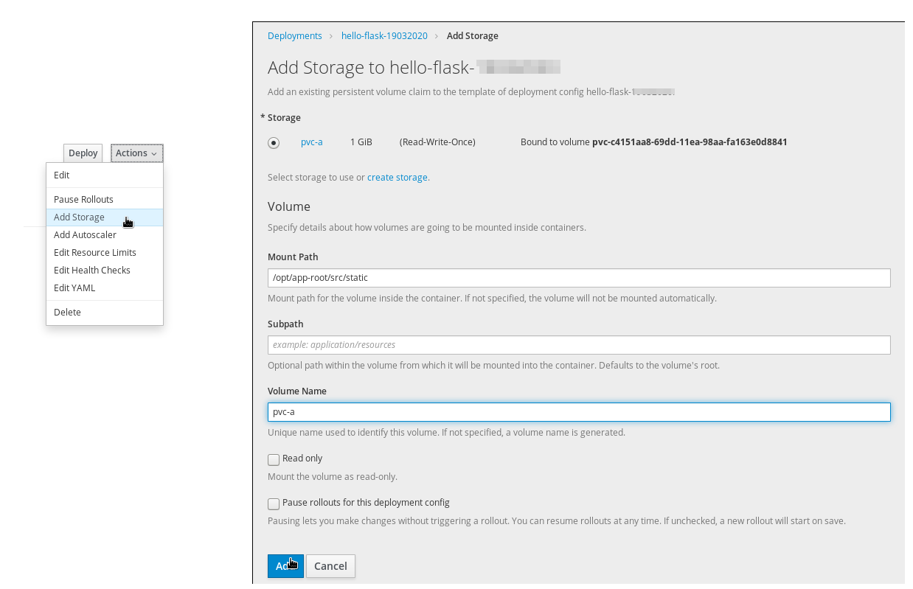
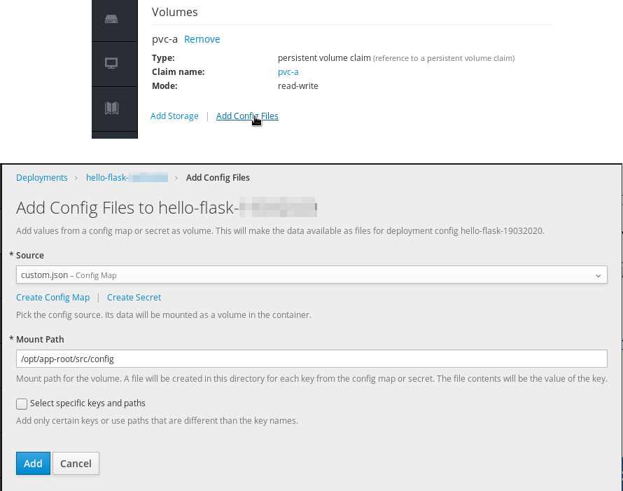
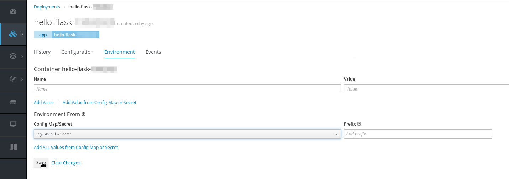

# 8. Application data on persistent volume

Pre-requisites: *Exercise 4*

In the following exercises you are expected to modify the YAML specification directly with the Rahti Application Console. At the Application Console page, the specification can be found by clicking "Applications → Deployments", then the name of the Deployment and finally clicking the upper right corner "Action → Edit YAML".



This exercise comprises of three parts:

1.  Create and mount a persistent volume with this **[picture](https://rahti-course-nov-2019.a3s.fi/kitten.jpg)**:

    to the application `hello-flask-#` made in **exercise 4** at `/opt/app-root/src/static`.

    First you need to create the PersistentVolumeClaim (PVC), you can use the CLI using:

    *`pvc.yaml`*
    ```yaml
    apiVersion: v1
    kind: PersistentVolumeClaim
    metadata:
      name: pvc-a
    spec:
    storageClassName: glusterfs-storage
    accessModes:
    - ReadWriteMany
    resources:
      requests:
        storage: 1Gi
    ```

    or do the creation from the web interface:

    

    

    Once created, it must be added to the `DeploymentConfig`. Do it using the web interface:

    

    Write `/opt/app-root/src/static` as the *Mount Path*, you can leave *Volume Name* empty, but it is recomended to use the same name as the PVC.

    Copy the file to the volume:

    ```bash
    # rsh to your hello-flask pod, get pod detail with oc get pods
    $ oc rsh hello-flask-#######
    # cd /opt/app-root/src/static/
    # curl -L -O https://rahti-course-nov-2019.a3s.fi/kitten.jpg
    ```

    Navigate to **<http://hello-flask-#-course-training-#.rahtiapp.fi/kitten>**, where # is your training account number and
    you should see a kitten.

    *Note*: It does not matter in which order you mount and copy, as long as you
    end up with pods with the file `/opt/app-root/src/static/kitten.jpg`.

2.  Create a configmap from file `custom.json` with the following contents:

    ```json
    {
     "greeting": "Custom Hello from custom.json"
    }

    ```

    You can create the configmap by using the command line interface:

    ```bash
    $ echo '{"greeting": "Custom Hello from custom.json"}' >custom.json
    $ oc create configmap custom.json --from-file=custom.json
    ```

    And then mount it using the web interface. Place the custom.json file visible in `/opt/app-root/src/config`.

    

3.  Create a secret and use that secret to bring environment variable
    "PASSWORD=secretPassword" to the application.

    You may change the password above to your liking.

    ```bash
    $ echo 'PASSWORD=secretPassword' >PASSWORD
    $ oc create secret generic my-secret --from-env-file=PASSWORD
    ```

    Once created, it can be added as an environment varible using the webinterface.

    

Loading urls <http://hello-flask-#-course-training-#.rahtiapp.fi/kitten> and <http://hello-flask-#-course-training-#.rahtiapp.fi/secret-kitten/secretPassword> (with # being the training account number entered earlier) should now display kittens

