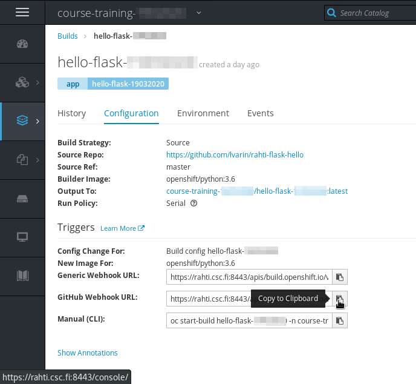
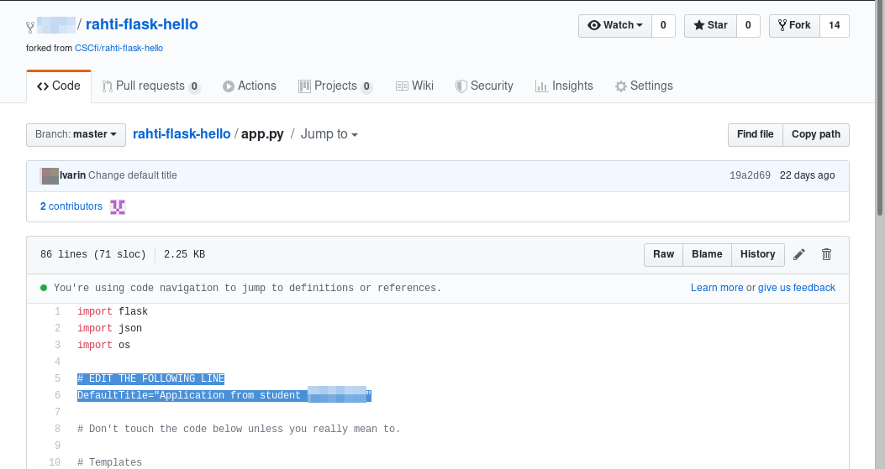

# 9. Webhook to hello-flask

Pre-requisites: *Exercise 4*.

You can now configure a GitHub webhook for your `hello-flask` application, this will trigger your application to build automatically when there are push events in your GitHub code.

Configure a GitHub webhook to the fork repository of `rahti-flask-hello` you made earlier in *Exercise 4*.

* To find out the secret in the webhook payload look at the BuildConfig of the application: `oc get bc hello-flask-# -o yaml` and look for element `github.secret` in the array `spec.triggers`, where `#` is your training account number.

In order to get the secret, a tool like `yq` can be used. `yq` can be installed with `pip3 install yq`.

```
$ oc get bc hello-flask-#### -o yaml | yq '.spec.triggers[] | select(.type == "GitHub").github.secret'
```

Then get the URL is by using `os describe`:

```
$ oc describe bc hello-flask-19032020 | grep -A 1 'Webhook GitHub'
```

Substitute `<secret>` by the secret obtained above. The URL can be obtainerd directly using the web interface:




* Edit app.py: Change line 6 to `DefaultTitle="Application from Student #"` where # is your training account number.



* Commit changes, verify that new build for your application is triggered in Rahti.

