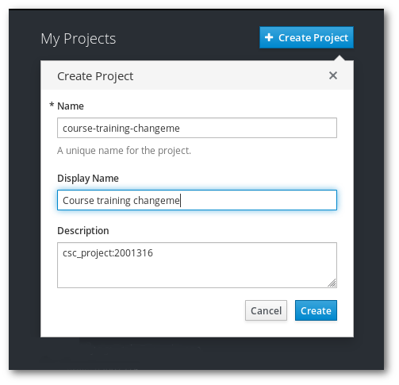

# Authorizing client session and creating a project

In this exercise we will just log in Rahti and create a project. This project will be used during all the exercises.

1. Log in Rahti's web console, [Rahti.csc.fi](https://rahti-int.csc.fi:8443/) using the credentials provided.

1. Create a rahti project named `course-training-<number>` using the web interface.

**Note**: Add "CSC_project: 2001316" as description of your rahti project.

