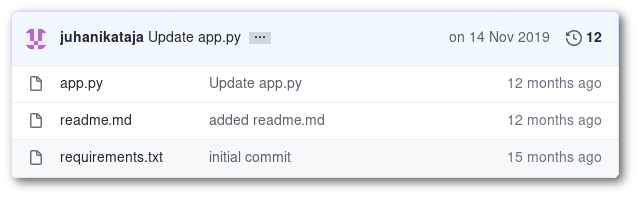

# Python application in Rahti

> Pre-requisites, the project created in *[Exercise 1](/exercises/A01/index.html)*

In this exercise we will deploy a Python template that uses Source2Image. We will use the following GIT repository as a base:

<https://github.com/CSCfi/rahti-flask-hello.git>

* First, go to Gihub and fork the repository into your personal space.

* Secondly, go to Rahti and create a Python 3.6 application, using your forked repository.
    * Name the application `Python-sample-<number>`, where `<number>` is the number in your training account.

* Once the application is up and running, find the URL where it is available to the internet, and visit it.
