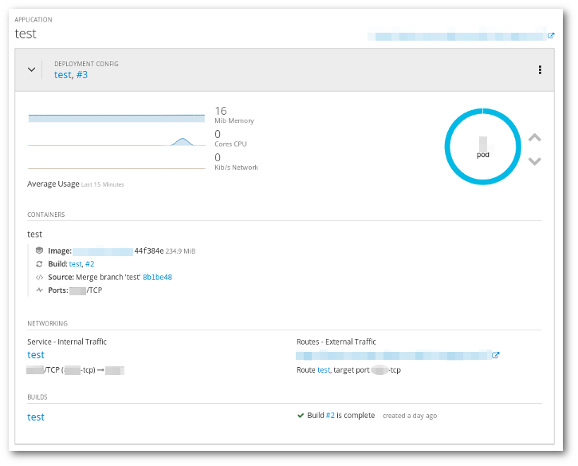
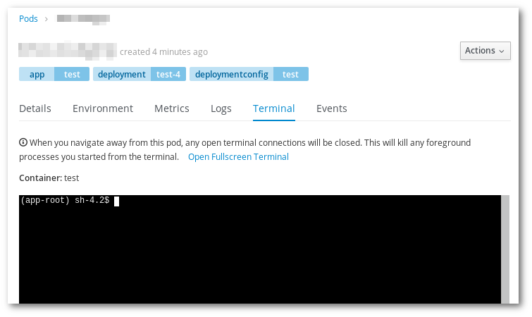

# Explore python application

> Pre-requisites, the application created in *[Exercise 2](/exercises/A02/index.html)*

In this exercise we will use the web interface to explore the application created in the previous step and get some data about it.

* Check the overview page in the web interface.
    * How many Pods are running?
    * Which ports are exposed for internal traffic?
    * Which URL is exposed for external traffic?
    * How much memory is being used? What about the CPU and network?

* Try to see the logs of the build, and check what was done. Which python packages were installed?

* From the webinterface, open a terminal to the running application and run few commands:
    * `ps x`
    * `cat /etc/os-release`

* Check the application logs, what information can you see? Can you see the log entry of the visit you made in the previuous exercise?
