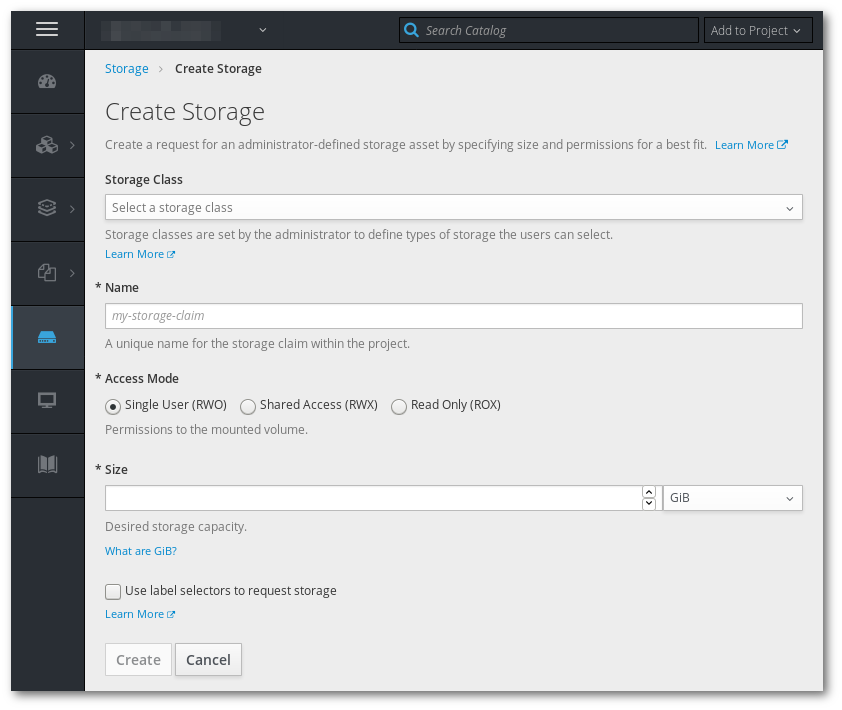

# Add persisten storage python application

> Pre-requisites, the application created in [Exercise 2](/exercises/A02/index.html)

In this exercise we will add persistent storage to the application.

* Go to the 'Application Console' Storage section and create a 1 GiB volume.

* Back in the deployment page, use the "Add storage" page to mount the volume you just created to the `/static` folder.

* Use the webinterface terminal to down load a JPG photo to the volume. (There are other ways to upload data to a volume, but that is a topic for another time)

<pre><code>wget https://upload.wikimedia.org/wikipedia/commons/thumb/b/bc/Juvenile_Ragdoll.jpg/1280px-Juvenile_Ragdoll.jpg \
    -O /static/1280px-Juvenile_Ragdoll.jpg
</code></pre>

* Go back to the application and check if you can see the photo you downloaded.

* Delete the running Pod, wait till it is recreated. If you reload the page that shows the photos, it should be still be displayed.
