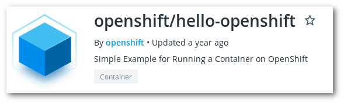

# Execute a container in a pod

> Pre-requisites, the project created in *[Exercise 1](/exercises/01-login-auth-project)*

In this exercise we will launch a simple container that will just say hello when asked at port 8888 using HTTP.

## Launch a POD

* From the 'Application console', run the image [`openshift/hello-openshift`](https://hub.docker.com/r/openshift/hello-openshift) in a pod called [hello-pod](/exercises/02-hello-world/hello-world-pod.yaml).

* From the 'Application console':
    * get the status of the pod, it must be "Running"
    * get the ip of the pod (it should begin by `10`)
    * and the standard output of the container, it must be saying that is listening to ports `8888` and `8080`.
